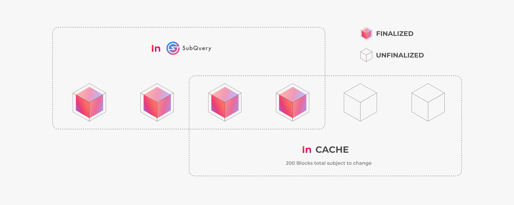

# Frequently Asked Questions
TODO

## when I do need subquery?
TODO: add more details

Transactions from unfinalized blocks only live in cache, so new transactions will usually be in the cache first (for a couple blocks), then live in both the cache and the subQuery, later, after the cache expires, they only live in subQuery.

Developers who run a mandala node and eth-rpc-adaptor locally, usually won’t need to start any subQuery or database services for testing. This is because when they deploy or call the smart contracts, new transactions will be in cache and findable without subQuery, as long as there is no need for querying the transactions older than 200 blocks.

## why tx failed after I manually changed gas params in metamask?
TODO

## how to fetch the valid gas params 

## why metamask tx doesn't confirm with local mandala?
TODO

## I have balance on metamask, but transfer failed
TODO

## tx failing reason not showing in blockscout
TODO

## how to check if a transaction is finalized?
TODO