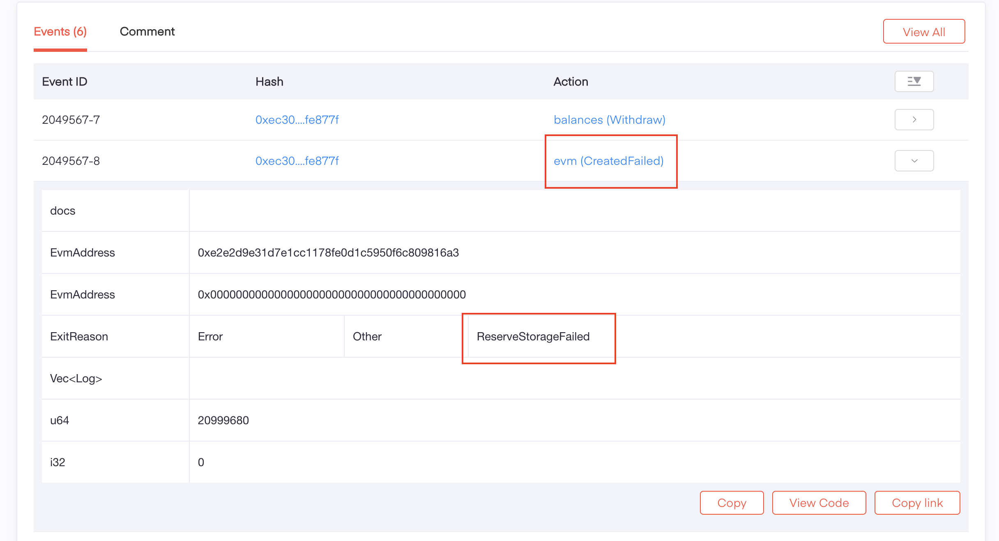

# Frequently Asked Questions

## when do I need to provide subquery url for `eth-rpc-adpater` or `EvmRpcProvider`?
**short answer**

you need it when you ...
- need to query for logs
- OR need to query for historical tx receipt that exist **before** you start the provider or rpc adapter
- OR need to query for tx receipt that's older than [MAX_CACHE_SIZE](../tooling/rpc-adapter/running-the-rpc-adapter.md#list-of-options), which defaults to 200.

**explanation**

Transactions from unfinalized blocks only live in cache, so new transactions will usually be in the cache first (for a couple blocks), then live in both the cache and the subquery, later, after the cache expires, they only live in subquery.

Developers who run a mandala node and eth-rpc-adaptor locally, usually won’t need to start any subquery or database services for testing, since new transaction receipt will be in cache and findable without subquery, as long as there is no need for querying the transactions older than 200 blocks.

Also, logs are **NOT** cached (we will probably implement log cache in the future). So if your tests rely on logs, for example if they call `eth_getLogs`, you will need subquery.

## why tx failed after I manually changed gas params in metamask?
The main difference between Acala EVM+ and legacy EVM is that we need to use pre-computed `gasPrice` and `gasLimit` combination. Manually inputting random gas parameters will fail to decode. Please refer to [gas parameter](../network/gas-parameters.md) section for detailed explanations.

## how to fetch valid gas params in different senarios
There are usually 3 ways to fetch the gas params ([more info](../network/gas-parameters.md#for-developers)): 
- Using an RPC call
- Using hardcoded values
- Using an SDK helper

They are suitable for different senarios:
- **in Dapp**: we suggest to use the **RPC call** to avoid importing extra dependencies of `@acala-network/eth-providers`.
- **in truffle**: we suggest to use **hardcoded values** in config to  override gas params globally, which is equivalent to starting the rpc adapter in [rich mode](../tooling/rpc-adapter/running-the-rpc-adapter.md#rich-mode) for local testing. ([tutorials](../tutorials/truffle-tutorials/))
- **in hardhat**: unlike truffle, hardhat doesn't support passing hardcoded global gas overrides in config, so we suggest to start the rpc adapter in [rich mode](../tooling/rpc-adapter/running-the-rpc-adapter.md#rich-mode) for local testing. Use the **SDK helper** or **hardcoded value** to override each tx gas in production scripts. ([tutorials](../tutorials/hardhat-tutorials/))

## why metamask tx doesn't confirm with local mandala?
Metamask will sometimes cache the nonce locally, which is used to infer next tx nonce. For example, if we send a tx with nonce 3, metamask will set nonce 4 for next tx. However, after we restart the local mandala node, all accounts are reset and the nonce is back to 0, but metamaks doesn't know it! 

As a result, the account with nonce 0 send a tx with nonce 4, which won't be mined and got stuck!

To solve this, we need to reset metamask after restarting local Mandala, so the nonce and cache will be cleared: `settings => advanced => reset account`. Or we can simply manually override the nonce to `0` for the first metamask tx after restarting the network.

## I have balance in metamask, but transfer failed
Metamask shows **total balance**, which might include non-transferable balances. For example, if some of your ACA is staking, they will still show in metamask, but can't be transfered.

We can check the transferable balance in the `Accounts` section in [polkadot.js app](../tooling/chain-explorer.md#polkadotjs-app)

## tx failing reason not showing in blockscout
Every EVM+ transaction is essentially a substrate transaction, so we can find more details about it in [substrate chain explorer](../tooling/chain-explorer.md#substrate-chain-explorer).

For example, for [this failing tx](https://blockscout.acala.network/tx/0xec304c62a61c56680522c09a80c7280fe4d985038203df70435cc925a7fe877f/internal-transactions), we can copy and paste the tx hash into the [Acala Subscan](https://acala.subscan.io/), which takes us to the [tx details page](https://acala.subscan.io/extrinsic/0xec304c62a61c56680522c09a80c7280fe4d985038203df70435cc925a7fe877f), the exact error should show up in the bottom `Events` section.

In this case `ReserveStorageFailed` means account balance not enough.

## how to check if a transaction is finalized?
there are 2 ways:
- use `eth_getBlockByNumber` with `finalized` block tag to get the latest finalized block number, and compare the tx block number with it.
- use EVM+ specific RPC calls: [eth_isTransactionFinalized](../tooling/rpc-adapter/rpc-calls.md#custom-rpcs) or [eth_isBlockFinalized](../tooling/rpc-adapter/rpc-calls.md#custom-rpcs).

## I have 20 ACA but contract deployment still failed with `ReserveStorageFailed`
We recommend keeping 30+ ACA in account for contract deployment. This is because even if the actual deployment or contract call doesn't consume that much ACA, it still requires a little bit more when doing balance check. 

For example, the tx might first reserve 30 ACA, and the acutal operation takes 10 ACA, then the remaining 20 ACA will be refund.